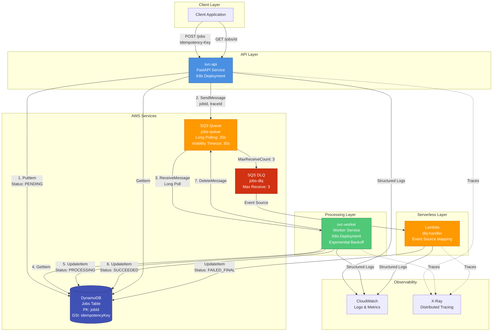

# Async Job Ticket System

A production-ready asynchronous job processing system built on AWS services (DynamoDB, SQS, Lambda) and Kubernetes. This system demonstrates real-world patterns for idempotency, retries, observability, error handling, and distributed system design.

## 🎯 What This System Does

This is a **job queue system** that allows clients to submit long-running or asynchronous tasks (like document processing, report generation, or data transformation) and check their status later. It's the backbone pattern behind:

- Order processing systems
- Document/image/video processing pipelines
- Report generation services
- Data transformation workflows
- Any async task that needs reliable execution

## 🏗️ Architecture Overview



### Architecture Components

#### **svc-api** (FastAPI Service)
- **Purpose**: REST API for job submission and status queries
- **Responsibilities**:
  - Validates incoming job requests
  - Enforces idempotency using client-provided keys
  - Creates job records in DynamoDB (status: `PENDING`)
  - Publishes messages to SQS for processing
  - Implements compensation pattern: if SQS publish fails, marks job as `FAILED`
- **Key Features**:
  - Idempotency key validation (prevents duplicate jobs)
  - Retry endpoint: `/jobs/{id}/retry` for stuck jobs
  - Health endpoints: `/healthz` (liveness), `/readyz` (readiness)
  - Structured logging with correlation IDs

#### **svc-worker** (Worker Service)
- **Purpose**: Processes jobs from SQS queue
- **Responsibilities**:
  - Long-polls SQS (20s wait time) to reduce empty receives
  - Processes jobs with idempotency checks
  - Updates job status in DynamoDB
  - Implements exponential backoff for transient failures
  - Deletes messages only on successful processing
- **Key Features**:
  - Exponential backoff: 1s → 2s → 4s (max 30s)
  - Idempotency: Skips already-processed jobs (`SUCCEEDED`/`FAILED_FINAL`)
  - Dual retry strategy: Worker retries + SQS redrive policy
  - Graceful shutdown handling

#### **Lambda DLQ Handler**
- **Purpose**: Handles jobs that failed after all retries
- **Responsibilities**:
  - Triggered by SQS event source mapping from DLQ
  - Marks jobs as `FAILED_FINAL` in DynamoDB
  - Stores error information for debugging
- **Key Features**:
  - Batch size: 1 (process one message at a time)
  - X-Ray tracing enabled
  - Automatic retry on Lambda failures

### Data Flow

#### Happy Path (Successful Job Processing)
1. **Client** sends `POST /api/v1/jobs` with `Idempotency-Key` header
2. **svc-api** validates idempotency (checks DynamoDB GSI for existing job)
3. **svc-api** creates job record in DynamoDB (status: `PENDING`)
4. **svc-api** publishes message to SQS with `jobId`, `traceId`, `payloadHash`
5. **svc-worker** long-polls SQS and receives message
6. **svc-worker** checks idempotency, updates job status to `PROCESSING`
7. **svc-worker** processes job (simulates work)
8. **svc-worker** updates job status to `SUCCEEDED` in DynamoDB
9. **svc-worker** deletes message from SQS
10. **Client** polls `GET /api/v1/jobs/{id}` to check status

#### Failure Flow (Retry Strategy)
1. **svc-worker** fails to process job (transient error)
2. **svc-worker** implements exponential backoff (up to 3 attempts)
3. If worker retries exhausted, message returns to SQS (visibility timeout expires)
4. SQS redrives message (up to 3 times via `maxReceiveCount`)
5. After 3 SQS retries, message moves to DLQ
6. **Lambda** triggered by DLQ event source mapping
7. **Lambda** marks job as `FAILED_FINAL` in DynamoDB

## ✨ Key Features

### 🔄 Idempotency
- **Client-provided keys**: Prevent duplicate job creation
- **DynamoDB GSI**: Fast lookups by idempotency key
- **Worker idempotency**: Skips already-processed jobs
- **24-hour expiration**: Idempotency keys expire after 24 hours

### 🔁 Dual Retry Strategy
- **Worker-level retries**: Exponential backoff (1s → 2s → 4s, max 30s)
- **SQS redrive policy**: Automatic retry up to 3 times
- **DLQ handling**: Failed jobs moved to DLQ after all retries exhausted

### 📊 Observability
- **Structured logging**: JSON logs with correlation IDs (`traceId`)
- **CloudWatch Metrics**: Custom metrics for job creation, processing, latency
- **X-Ray tracing**: Distributed tracing across API → SQS → Worker → Lambda
- **Health probes**: Liveness and readiness endpoints for Kubernetes

### 🛡️ Error Handling
- **Compensation pattern**: If SQS publish fails, job marked as `FAILED`
- **Partial failure handling**: DynamoDB write succeeds, SQS fails → compensation
- **DLQ for final failures**: Jobs that fail after all retries
- **Retry endpoint**: Manual retry for stuck jobs

### ☸️ Kubernetes Ready
- **Full K8s deployment**: Deployments, Services, ConfigMaps
- **Health probes**: Liveness and readiness checks
- **Resource limits**: CPU and memory constraints
- **Environment-based configs**: Dev/staging/prod overlays

## 🚀 Quick Start

### Prerequisites
- Docker installed and running
- Python 3.11+ installed
- AWS CLI installed (for LocalStack testing)
- Basic terminal/command line knowledge

### Local Development (Recommended First Step)

**1. Start LocalStack (AWS emulator)**
```bash
docker-compose up -d localstack
```

**2. Initialize local infrastructure**
```bash
./scripts/local-dev.sh
```

This creates:
- DynamoDB table: `Jobs`
- SQS queue: `jobs-queue`
- SQS DLQ: `jobs-dlq`

**3. Run the API service**

In one terminal:
```bash
cd services/svc-api
python3 -m venv venv
source venv/bin/activate
pip install poetry && poetry install

export AWS_ENDPOINT_URL=http://localhost:4566
export AWS_ACCESS_KEY_ID=test
export AWS_SECRET_ACCESS_KEY=test
export AWS_DEFAULT_REGION=us-east-1
export DDB_TABLE=Jobs
export SQS_QUEUE_URL=$(aws --endpoint-url=http://localhost:4566 sqs get-queue-url --queue-name jobs-queue --query 'QueueUrl' --output text)

python3 -m uvicorn svc_api.main:app --port 8080 --reload
```

**4. Run the Worker service**

In another terminal:
```bash
cd services/svc-worker
python3 -m venv venv
source venv/bin/activate
pip install poetry && poetry install

export AWS_ENDPOINT_URL=http://localhost:4566
export AWS_ACCESS_KEY_ID=test
export AWS_SECRET_ACCESS_KEY=test
export AWS_DEFAULT_REGION=us-east-1
export DDB_TABLE=Jobs
export SQS_QUEUE_URL=$(aws --endpoint-url=http://localhost:4566 sqs get-queue-url --queue-name jobs-queue --query 'QueueUrl' --output text)

python -m svc_worker.main
```

**5. Test the system**

Create a job:
```bash
curl -X POST http://localhost:8080/api/v1/jobs \
  -H "Content-Type: application/json" \
  -H "Idempotency-Key: test-key-123" \
  -d '{
    "type": "process_document",
    "priority": "normal",
    "params": {
      "source": "s3://bucket/test.pdf"
    }
  }'
```

Check job status (replace `{jobId}` with the returned `jobId`):
```bash
curl http://localhost:8080/api/v1/jobs/{jobId}
```

The worker should process the job within a few seconds, and the status should change from `PENDING` → `PROCESSING` → `SUCCEEDED`.

> 📖 **For detailed step-by-step instructions**, see the [Quick Start Guide](docs/quick-start.md)

## 📚 Documentation

- **[Quick Start Guide](docs/quick-start.md)** - Step-by-step instructions for local development
- **[Architecture Documentation](docs/architecture.md)** - Detailed system design and data flows
- **[API Documentation](docs/api.md)** - REST API endpoints and examples
- **[Technology Guide](docs/tech-guide.md)** - Explanations of all technologies used
- **[Deployment Guide](docs/deployment.md)** - AWS and Kubernetes deployment instructions

## 🏛️ Project Structure

```
.
├── services/
│   ├── svc-api/              # FastAPI service for job submission
│   │   ├── src/svc_api/
│   │   │   ├── api/          # FastAPI routes and schemas
│   │   │   ├── service/      # Business logic (job service)
│   │   │   ├── domain/       # Domain models and interfaces
│   │   │   └── infra/        # Infrastructure (DynamoDB, SQS, logging)
│   │   └── tests/            # Unit and integration tests
│   └── svc-worker/           # Worker service for processing jobs
│       ├── src/svc_worker/
│       │   ├── service/      # Job processor
│       │   ├── domain/       # Domain models
│       │   └── infra/        # Infrastructure clients
│       └── tests/            # Unit tests
├── lambda/
│   └── dlq-handler/          # Lambda function for DLQ processing
├── infra/
│   ├── aws-cli/              # Infrastructure setup scripts
│   │   ├── create-table.sh   # DynamoDB table
│   │   ├── create-queues.sh  # SQS queues and DLQ
│   │   ├── create-ecr-repos.sh  # ECR repositories
│   │   └── setup-parameter-store.sh  # Parameter Store config
│   └── iam/                  # IAM policies
│       ├── svc-api-policy.json
│       ├── svc-worker-policy.json
│       └── lambda-policy.json
├── k8s/                      # Kubernetes manifests
│   ├── base/                 # Base configurations
│   │   ├── namespace.yaml
│   │   ├── svc-api/
│   │   │   ├── deployment.yaml
│   │   │   ├── service.yaml
│   │   │   └── configmap.yaml
│   │   └── svc-worker/
│   │       ├── deployment.yaml
│   │       └── configmap.yaml
│   └── overlays/             # Environment-specific configs
│       └── dev/
├── scripts/
│   ├── local-dev.sh          # Local development setup
│   ├── deploy.sh             # Kubernetes deployment
│   └── teardown.sh           # Cleanup script
└── docs/                     # Documentation
    ├── quick-start.md
    ├── architecture.md
    ├── api.md
    ├── tech-guide.md
    └── deployment.md
```

## 🧪 Testing

```bash
# Test the API service
cd services/svc-api
pytest

# Test the worker service
cd services/svc-worker
pytest
```

## 🚢 Deployment

### AWS Deployment

**1. Create AWS infrastructure:**
```bash
./infra/aws-cli/create-table.sh
./infra/aws-cli/create-queues.sh
./infra/aws-cli/create-ecr-repos.sh
./infra/aws-cli/setup-parameter-store.sh
```

**2. Build and push Docker images:**
```bash
# See docs/deployment.md for detailed instructions
```

**3. Deploy to Kubernetes:**
```bash
./scripts/deploy.sh
```

> 📖 **For detailed deployment instructions**, see the [Deployment Guide](docs/deployment.md)

## 💰 Cost Considerations

This system is designed to be **free-tier eligible** for small-scale usage:

- **DynamoDB**: 25GB storage, 25 RCU, 25 WCU (free tier)
- **SQS**: 1M requests/month (free tier)
- **Lambda**: 1M requests, 400k GB-seconds (free tier)
- **CloudWatch Logs**: 5GB ingestion/month (free tier)
- **CloudWatch Metrics**: 10 custom metrics (free tier)
- **X-Ray**: 100k traces/month (free tier)
- **Parameter Store**: 10k parameters (standard tier, free)

**Cost hotspots** (after free tier):
- EC2 instance (for k3s cluster)
- DynamoDB on-demand pricing
- CloudWatch Logs storage
- ECR storage for Docker images

## 🔒 Security

- **IAM Least Privilege**: Each service has minimal required permissions
- **Separate IAM policies**: API, Worker, and Lambda have distinct policies
- **No secrets in code**: AWS Systems Manager Parameter Store for configuration
- **Input validation**: All API inputs are validated
- **Idempotency protection**: Prevents duplicate job creation

## 🧹 Cleanup

**Local development:**
```bash
docker-compose down
rm -rf localstack-data/
```

**AWS resources:**
```bash
./scripts/teardown.sh
```

⚠️ **Warning**: The teardown script deletes all AWS resources. Use with caution!

## 🤝 Contributing

This is a learning project demonstrating production patterns. Feel free to:
- Experiment with different job types
- Add new features
- Improve error handling
- Enhance observability

## 📄 License

MIT

---

**Built with**: FastAPI, Python, AWS (DynamoDB, SQS, Lambda), Kubernetes, Docker, LocalStack
