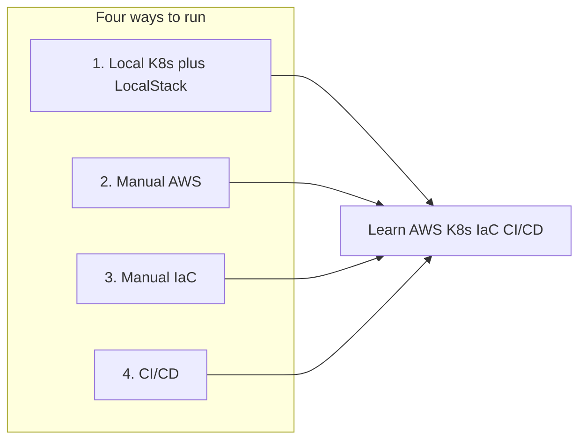
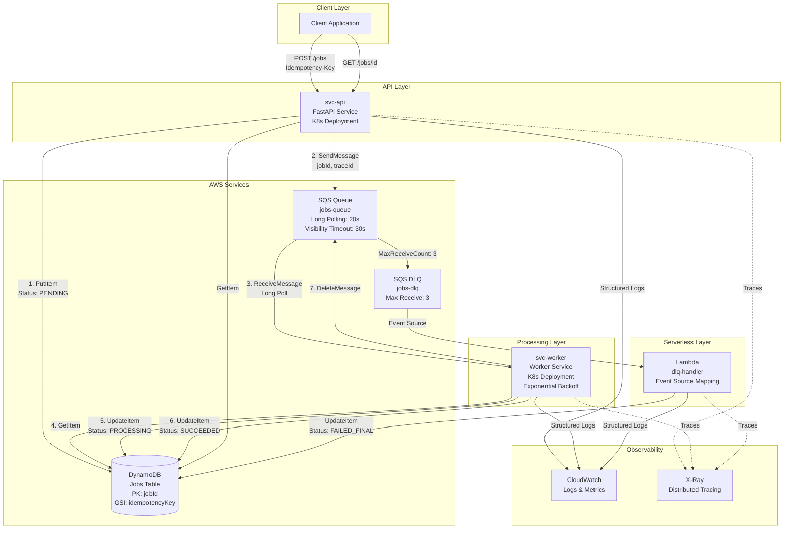

# Async Job Ticket System

A production-ready asynchronous job processing system built on AWS (DynamoDB, SQS, Lambda, EC2, ECS, ECR, IAM, CloudWatch, Parameter Store, CloudFormation) and Kubernetes. This system demonstrates real-world patterns for idempotency, retries, observability, error handling, and distributed system design.

## About This Project

This repo is a **learning project** for **AWS, Infrastructure as Code (IaC), Kubernetes, and CI/CD**. It provides hands-on practice with real-world patterns—async job queues, serverless (Lambda), managed services (DynamoDB, SQS), and containers—so you can learn these stacks by running and deploying the same application in different ways.

**Technologies and concepts:**

- **AWS:** DynamoDB, SQS, Lambda, EC2, ECS, ECR, IAM, CloudWatch, Parameter Store, CloudFormation
- **Kubernetes:** local clusters (e.g. minikube)
- **CI/CD:** GitHub Actions
- **Application & tooling:** FastAPI, Docker, LocalStack

**Disclaimer:** Although this repository contains scripts that automate infrastructure and deployment, I chose and recommend to perform all steps manually (AWS Console, CLI, CloudFormation, etc.) in order to learn the concepts and workflows. The scripts document the process and are available for others who prefer automation or for later use.

## Four Ways to Run This System

You can run this system in four ways, from local learning to automated cloud deployment. Pick one path (or follow them in order) based on what you want to learn.

| Path | What you use | Best for | Doc / script |
|------|----------------|----------|----------------|
| **1. Local with K8s + LocalStack** | Local Kubernetes (minikube/kind/k3d) + LocalStack (DynamoDB, SQS) | Learning K8s and AWS services without cloud cost | [Deployment options](docs/deployment-options.md) (Option 1), `./scripts/deploy-k8s-local.sh` |
| **2. Manual deploy on AWS** | AWS CLI scripts, EC2 or ECS, Parameter Store | Understanding AWS services and manual ops | [Manual deployment guide](docs/manual-deployment-guide.md) |
| **3. Manual deploy with IaC** | CloudFormation (YAML stacks) | Learning IaC and repeatable infra | [IaC CloudFormation guide](docs/iac-cloudformation-guide.md), [infra/cloudformation/](infra/cloudformation/) |
| **4. Deploy with CI/CD** | GitHub Actions (validate, deploy infra + app) | Learning pipelines and automated deployment | [CI/CD workflows](.github/workflows/README.md), [IaC guide – CI/CD section](docs/iac-cloudformation-guide.md) |

**Suggested order:** Start with **Path 1** (local K8s + LocalStack) or the [Quick Start Guide](docs/quick-start.md), then try **Path 2** or **Path 3** on AWS, and finally **Path 4** for CI/CD.



## 🎯 What This System Does

This is a **job queue system** that allows clients to submit long-running or asynchronous tasks (like document processing, report generation, or data transformation) and check their status later. It's the backbone pattern behind:

- Order processing systems
- Document/image/video processing pipelines
- Report generation services
- Data transformation workflows
- Any async task that needs reliable execution

## 🏗️ Architecture Overview



You can run this full flow locally (K8s + LocalStack) or on AWS (manual or via IaC/CI/CD)—see [Four ways to run this system](#four-ways-to-run-this-system).

### Architecture Components

#### **svc-api** (FastAPI Service)
- **Purpose**: REST API for job submission and status queries
- **Responsibilities**:
  - Validates incoming job requests
  - Enforces idempotency using client-provided keys
  - Creates job records in DynamoDB (status: `PENDING`)
  - Publishes messages to SQS for processing
  - Implements compensation pattern: if SQS publish fails, marks job as `FAILED`
- **Key Features**:
  - Idempotency key validation (prevents duplicate jobs)
  - Retry endpoint: `/jobs/{id}/retry` for stuck jobs
  - Health endpoints: `/healthz` (liveness), `/readyz` (readiness)
  - Structured logging with correlation IDs

#### **svc-worker** (Worker Service)
- **Purpose**: Processes jobs from SQS queue
- **Responsibilities**:
  - Long-polls SQS (20s wait time) to reduce empty receives
  - Processes jobs with idempotency checks
  - Updates job status in DynamoDB
  - Implements exponential backoff for transient failures
  - Deletes messages only on successful processing
- **Key Features**:
  - Exponential backoff: 1s → 2s → 4s (max 30s)
  - Idempotency: Skips already-processed jobs (`SUCCEEDED`/`FAILED_FINAL`)
  - Dual retry strategy: Worker retries + SQS redrive policy
  - Graceful shutdown handling

#### **Lambda DLQ Handler**
- **Purpose**: Handles jobs that failed after all retries
- **Responsibilities**:
  - Triggered by SQS event source mapping from DLQ
  - Marks jobs as `FAILED_FINAL` in DynamoDB
  - Stores error information for debugging
- **Key Features**:
  - Batch size: 1 (process one message at a time)
  - X-Ray tracing enabled
  - Automatic retry on Lambda failures

### Data Flow

#### Happy Path (Successful Job Processing)
1. **Client** sends `POST /api/v1/jobs` with `Idempotency-Key` header
2. **svc-api** validates idempotency (checks DynamoDB GSI for existing job)
3. **svc-api** creates job record in DynamoDB (status: `PENDING`)
4. **svc-api** publishes message to SQS with `jobId`, `traceId`, `payloadHash`
5. **svc-worker** long-polls SQS and receives message
6. **svc-worker** checks idempotency, updates job status to `PROCESSING`
7. **svc-worker** processes job (simulates work)
8. **svc-worker** updates job status to `SUCCEEDED` in DynamoDB
9. **svc-worker** deletes message from SQS
10. **Client** polls `GET /api/v1/jobs/{id}` to check status

#### Failure Flow (Retry Strategy)
1. **svc-worker** fails to process job (transient error)
2. **svc-worker** implements exponential backoff (up to 3 attempts)
3. If worker retries exhausted, message returns to SQS (visibility timeout expires)
4. SQS redrives message (up to 3 times via `maxReceiveCount`)
5. After 3 SQS retries, message moves to DLQ
6. **Lambda** triggered by DLQ event source mapping
7. **Lambda** marks job as `FAILED_FINAL` in DynamoDB

## ✨ Key Features

### 🔄 Idempotency
- **Client-provided keys**: Prevent duplicate job creation
- **DynamoDB GSI**: Fast lookups by idempotency key
- **Worker idempotency**: Skips already-processed jobs
- **24-hour expiration**: Idempotency keys expire after 24 hours

### 🔁 Dual Retry Strategy
- **Worker-level retries**: Exponential backoff (1s → 2s → 4s, max 30s)
- **SQS redrive policy**: Automatic retry up to 3 times
- **DLQ handling**: Failed jobs moved to DLQ after all retries exhausted

### 📊 Observability
- **Structured logging**: JSON logs with correlation IDs (`traceId`)
- **CloudWatch Metrics**: Custom metrics for job creation, processing, latency
- **X-Ray tracing**: Distributed tracing across API → SQS → Worker → Lambda
- **Health probes**: Liveness and readiness endpoints for Kubernetes

### 🛡️ Error Handling
- **Compensation pattern**: If SQS publish fails, job marked as `FAILED`
- **Partial failure handling**: DynamoDB write succeeds, SQS fails → compensation
- **DLQ for final failures**: Jobs that fail after all retries
- **Retry endpoint**: Manual retry for stuck jobs

### ☸️ Kubernetes Ready (Local Only)
- **Full K8s deployment**: Deployments, Services, ConfigMaps for local learning
- **Health probes**: Liveness and readiness checks
- **Resource limits**: CPU and memory constraints
- **Local cluster support**: Works with minikube, kind, k3d

### ☁️ AWS Cloud Deployment
- **ECS Fargate**: Serverless container deployment (recommended)
- **EC2 + Docker Compose**: Simple single-instance deployment
- **No Kubernetes required**: Simpler alternatives for small applications

## 📚 Documentation

- **[Quick Start Guide](docs/quick-start.md)** – Local development (no K8s), running tests, and cleanup
- **[Deployment options](docs/deployment-options.md)** – Comparison and Path 1 (local K8s)
- **[Manual AWS deployment](docs/manual-deployment-guide.md)** – Path 2
- **[IaC and CI/CD](docs/iac-cloudformation-guide.md)** – Path 3 and 4 (CloudFormation, GitHub Actions)
- **[CI/CD workflows](.github/workflows/README.md)** – Pipeline reference
- **[Architecture](docs/architecture.md)** – System design and data flows
- **[API](docs/api.md)** – REST endpoints and examples
- **[Deployment guide](docs/deployment.md)** – Legacy AWS deployment reference

## 🏛️ Project Structure

```
.
├── services/
│   ├── svc-api/              # FastAPI service for job submission
│   │   ├── src/svc_api/
│   │   │   ├── api/          # FastAPI routes and schemas
│   │   │   ├── service/      # Business logic (job service)
│   │   │   ├── domain/       # Domain models and interfaces
│   │   │   └── infra/        # Infrastructure (DynamoDB, SQS, logging)
│   │   └── tests/            # Unit and integration tests
│   └── svc-worker/           # Worker service for processing jobs
│       ├── src/svc_worker/
│       │   ├── service/      # Job processor
│       │   ├── domain/       # Domain models
│       │   └── infra/        # Infrastructure clients
│       └── tests/            # Unit tests
├── lambda/
│   └── dlq-handler/          # Lambda function for DLQ processing
├── .github/
│   └── workflows/            # CI/CD (Path 4): infrastructure.yml, application.yml, combined.yml
├── infra/
│   ├── aws-cli/              # Infrastructure setup scripts
│   │   ├── create-table.sh   # DynamoDB table
│   │   ├── create-queues.sh  # SQS queues and DLQ
│   │   ├── create-ecr-repos.sh  # ECR repositories
│   │   └── setup-parameter-store.sh  # Parameter Store config
│   ├── cloudformation/      # IaC (Path 3): CloudFormation templates and deploy scripts
│   │   ├── templates/       # 01-iam through 08-cloudwatch
│   │   ├── parameters/      # dev.json, prod.json
│   │   ├── deploy.sh
│   │   └── teardown.sh
│   ├── ecs/                  # ECS Fargate deployment (recommended)
│   │   ├── task-definition-api.json
│   │   ├── task-definition-worker.json
│   │   ├── create-cluster.sh
│   │   └── deploy-ecs.sh
│   ├── ec2/                  # EC2 + Docker Compose deployment
│   │   ├── docker-compose.prod.yml
│   │   ├── create-ec2-instance.sh
│   │   └── deploy-to-ec2.sh
│   └── iam/                  # IAM policies
│       ├── svc-api-policy.json
│       ├── svc-worker-policy.json
│       ├── lambda-policy.json
│       └── ecs-task-execution-role-policy.json
├── k8s/                      # Kubernetes manifests (LOCAL ONLY)
│   ├── base/                 # Base configurations
│   │   ├── namespace.yaml
│   │   ├── svc-api/
│   │   │   ├── deployment.yaml
│   │   │   ├── service.yaml
│   │   │   └── configmap.yaml
│   │   └── svc-worker/
│   │       ├── deployment.yaml
│   │       └── configmap.yaml
│   └── overlays/             # Environment-specific configs
│       └── dev/
├── scripts/
│   ├── local-dev.sh          # Local development setup (LocalStack)
│   ├── deploy-k8s-local.sh   # Path 1: local K8s deployment
│   ├── deploy.sh             # Path 2: ECS or EC2 deployment (--ecs / --ec2)
│   └── teardown.sh           # Cleanup script
└── docs/                     # Documentation
    ├── quick-start.md
    ├── deployment-options.md
    ├── manual-deployment-guide.md
    ├── iac-cloudformation-guide.md
    ├── architecture.md
    ├── api.md
    └── deployment.md
```

## 🚢 Deployment

Deployment is organized into **four paths**; see [Four ways to run this system](#four-ways-to-run-this-system) for the full map.

- **Local K8s (Path 1):** `./scripts/deploy-k8s-local.sh` — see [Deployment options](docs/deployment-options.md) (Option 1).
- **AWS – ECS or EC2 (Path 2):** Create infra with [manual-deployment-guide](docs/manual-deployment-guide.md), then run `./scripts/deploy.sh --ecs` or `./scripts/deploy.sh --ec2`.
- **IaC (Path 3):** [IaC CloudFormation guide](docs/iac-cloudformation-guide.md) and [infra/cloudformation/](infra/cloudformation/).
- **CI/CD (Path 4):** [CI/CD workflows](.github/workflows/README.md) and the CI/CD section in the [IaC guide](docs/iac-cloudformation-guide.md).

## 💰 Cost Considerations

**⚠️ Warning — your responsibility:** Running infrastructure or scripts in this repository (especially on AWS or other cloud providers) can incur costs. The author is not responsible for any charges you incur. Always be aware of what you run and execute: check your provider’s pricing, set billing alerts, and tear down resources when you are done. When in doubt, prefer local-only options (LocalStack, local Kubernetes) to avoid cloud costs.

This system can be **free-tier eligible** for small-scale usage, but only under your own account and within your provider’s terms:

- **DynamoDB**: 25GB storage, 25 RCU, 25 WCU (free tier)
- **SQS**: 1M requests/month (free tier)
- **Lambda**: 1M requests, 400k GB-seconds (free tier)
- **CloudWatch Logs**: 5GB ingestion/month (free tier)
- **CloudWatch Metrics**: 10 custom metrics (free tier)
- **X-Ray**: 100k traces/month (free tier)
- **Parameter Store**: 10k parameters (standard tier, free)

**Cost hotspots** (after free tier):
- EC2 instance (for k3s cluster)
- DynamoDB on-demand pricing
- CloudWatch Logs storage
- ECR storage for Docker images

## 🔒 Security

- **IAM Least Privilege**: Each service has minimal required permissions
- **Separate IAM policies**: API, Worker, and Lambda have distinct policies
- **No secrets in code**: AWS Systems Manager Parameter Store for configuration
- **Input validation**: All API inputs are validated
- **Idempotency protection**: Prevents duplicate job creation

## 🤝 Contributing

This is a learning project for AWS, IaC, K8s, and CI/CD, demonstrating production patterns. Feel free to experiment and learn:
- Try different deployment paths (local K8s, manual AWS, IaC, CI/CD)
- Experiment with different job types
- Add new features
- Improve error handling
- Enhance observability

## 📄 License

MIT

---

**Built with:** FastAPI, Python, AWS (DynamoDB, SQS, Lambda, EC2, ECS, ECR, IAM, CloudWatch, Parameter Store, CloudFormation), Kubernetes, Docker, LocalStack
